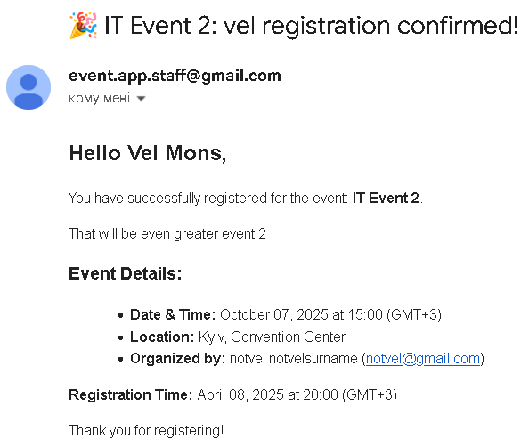
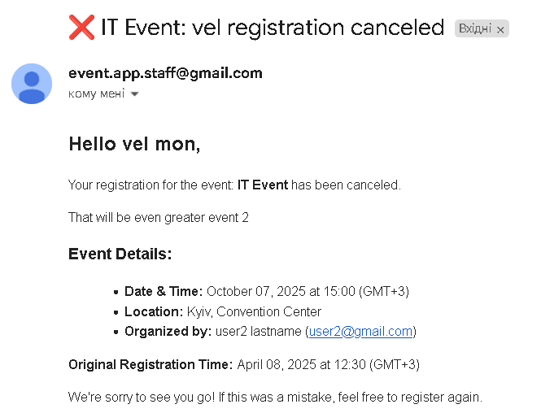

# **Event Management API**

A Django REST API for managing events, user authentication, and event registrations. The project uses Docker to containerize services including:
- **PostgreSQL** (for the database)
- **Redis** (for message brokering with Celery)
- **Django web server** (for handling API requests)
- **Celery worker** (for asynchronous tasks)


### **Project Features:**
- **User Authentication**: JWT-based authentication.
- **Event Management:**
  - CRUD operations for events + filtering.
  - Event validation (future date, organizer auto-set).
- **Event Registration**: Users can register and unregister for events.
- **Email Notifications:**
  - For event registration:
    
  - For event registration cancellation:
    


### API Documentation

You can explore the available API endpoints using the basic built-in schema and documentation tools:

- **OpenAPI Schema (JSON):**  
  [`/api/schema/`](http://localhost:8000/api/schema/)

- **Swagger UI (Interactive docs):**  
  [`/api/docs/swagger/`](http://localhost:8000/api/docs/swagger/)

- **ReDoc (Styled API reference):**  
  [`/api/docs/redoc/`](http://localhost:8000/api/docs/redoc/)
 
For more detailed request/response examples and real usage:
- [Link to Postman Documentation](https://www.postman.com/science-candidate-74537104/event-management/documentation/wuw0ovb/event-management)


### **Docker Setup Instructions:**

To run the project using Docker, follow these steps:

#### 1. **Clone the Repository:**
   If you haven’t already, clone the repository:
   ```bash
   git clone https://github.com/velinamons/event-management.git
   cd event_management
   ```

#### 2. **Create `.env` File:**
   Create a `.env` file based on the `.env.sample` template:
   - Copy the `.env.sample` to `.env`:
     ```bash
     cp .env.sample .env
     ```
   - Edit the `.env` file with appropriate values for your environment:
     - Replace `SECRET_KEY` with a strong Django secret key.
     - Configure your database settings (`DB_NAME`, `DB_USER`, `DB_PASSWORD`, etc.).
     - Add your Redis and email credentials.

#### 3. **Build the Docker Containers:**
   Build the Docker containers using Docker Compose:
   ```bash
   docker-compose build
   ```

#### 4. **Start the Docker Containers:**
   Start the containers in the background:
   ```bash
   docker-compose up -d
   ```
   This will start the services defined in `docker-compose.yml`, including:
   - PostgreSQL database (`db`)
   - Redis message broker (`redis`)
   - Django web server (`web`)
   - Celery worker (`celery`)

#### 5. **Access the Django Application:**
   The entrypoint script (`entrypoint.sh`) will automatically wait for the PostgreSQL database to be ready and apply migrations.

   Once the containers are up and running, access the Django application by navigating to:
   ```
   http://localhost:8000
   ```

#### 6. **Creating Superuser (Optional):**
   To create a superuser for accessing the Django admin panel, run the following:
   ```bash
   docker-compose exec web python manage.py createsuperuser
   ```

#### 7. **Check Logs (Optional):**
   You can view the logs for any container using the following command:
   ```bash
   docker-compose logs web
   ```

#### 8. **Stopping the Docker Containers:**
   To stop the running containers, use:
   ```bash
   docker-compose down
   ```
